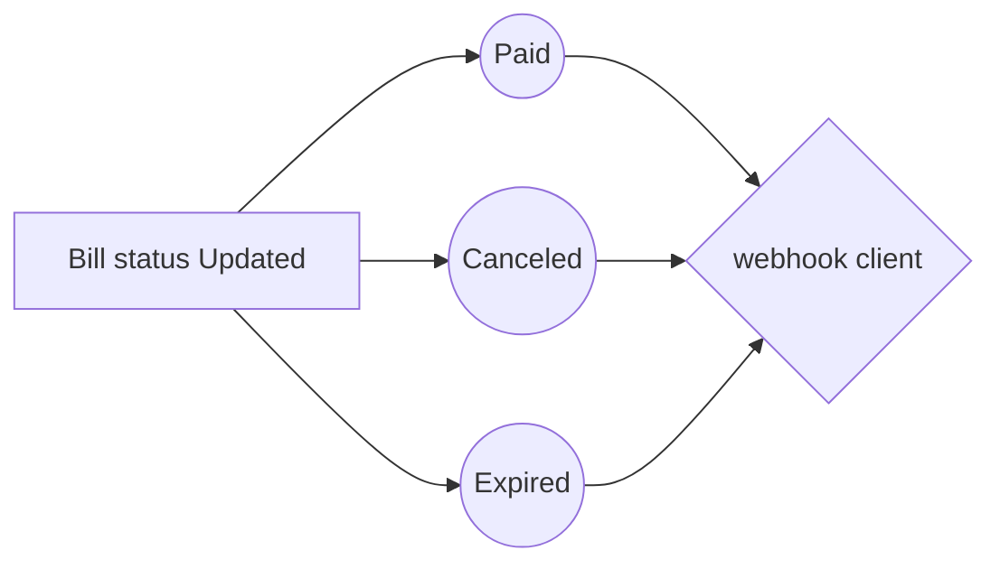

# How integrate with Sure Bills
after [register](https://bills.surepay.sa/register) in sure bills and complete your account.

## Create Integration Application

 1. Go to integration page [integration](https://bills.surepay.sa/integration).
 2. Create new application with [**name**, **redirect url**, **webhook url**].
 3. After Submit you will see new **secert** and **webhook secret**. 
 
> make sure the **Redirect Url** and **Webhook Url** are existing url in your application.

> webhook server sensitive if url in **https** or **http**.
## Handel Webhook call

 - webhooks use the `post` method
 - sure bills add a **header** called `Signature` that will contain a signature.
 - webhook send body request that will contain:
```php
        'reference_id' => (string) id,  //bill status
        'status' => (string) status,    //bill status 
        'bill_id' => (string) uuid,     //bill id 
        'total' => (int) 16056,         //total anount of bill
        'pay_url' => (string) link,     //
  ```
- to check webhook hashed data in `Signature` by your `webhook secret` .

```php
    $payloadJson = json_encode($payload)); 
    $signature = hash_hmac('sha256', $payloadJson, webhook_secret);
    if($signature == $_SERVER['HTTP_SIGNATURE']){
        //code here
    }
``` 

## flow chart

And this will produce a flow chart:




